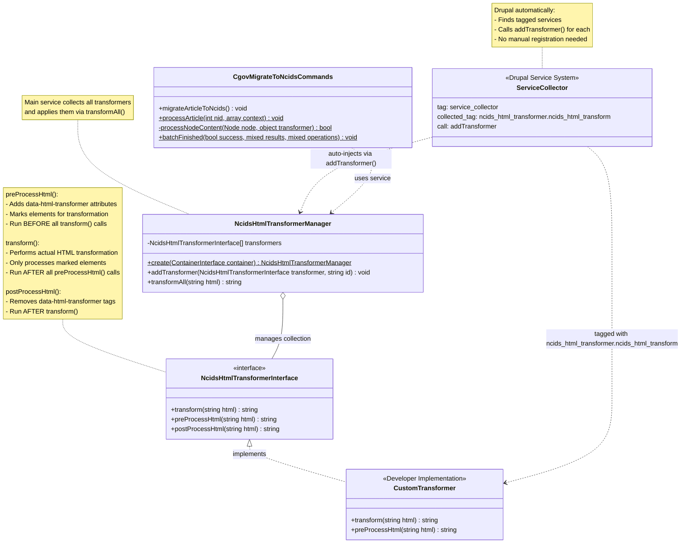

# NCIDS HTML Transformer Module

## Architecture



## How It Works

### Three-Phase Transformation Process

The transformation system operates in three distinct phases:

1. **Pre-Processing Phase** (`preProcessHtml()`)
   - Adds `data-html-transformer="<identifier>"` attributes to elements
   - Marks elements that handle transformations themselves
   - Runs for ALL transformers before any transformation occurs
   - Allows transformers to "claim" elements without conflicts

2. **Transformation Phase** (`transform()`)
   - Performs the actual HTML transformation
   - Only processes elements marked with `data-html-transformer` attributes
   - Runs for ALL transformers after pre-processing is complete
   - Applied in priority order (lower priority numbers execute first)

3. **Post-Processing Phase** (`postProcessHtml()`)
   - Cleans up `data-html-transformer` attributes
   - Runs AFTER all transformations are complete
   - Ensures final output is clean

### Service Registration

The `NcidsHtmlTransformerManager` uses Drupal's service collector pattern to automatically discover and register all transformer services. Transformers are automatically injected based on their service tag.

## Creating a New Transformer

### Step 1: Create the Transformer Class

Create a new class that extends `NcidsHtmlTransformerBase`:

If pre-processing the HTML is required, add the $preprocessClasses array with classes to look for to add the data tag.

### Step 2: Register the Service

Add your transformer to `ncids_html_transformer.services.yml`:

```yaml
services:
  ncids_html_transformer.callout_box_transformer:
    class: Drupal\ncids_html_transformer\Services\NcidsCalloutBoxTransformer
    arguments: ['@ncids_html_transformer.html_transformer_manager']
    tags:
      - { name: ncids_html_transformer.ncids_html_transform, priority: 9 }
```

**Important Notes:**
- The service tag `ncids_html_transformer.ncids_html_transform` is required for auto-registration
- **Priority determines execution order** (lower numbers = higher priority = executed first)
- Priority ranges:
  - `1-3`: Early preprocessing (lists, embedded entities, pullquotes)
  - `4-5`: Element marking (tables, callout boxes)
  - `6-8`: Cleanup (disallowed classes, styles, attributes)
  - `9+`: Complex transformations (callout boxes with nested content)

### Step 3: Write Unit Tests

Create a test class in `tests/src/Unit/`:

```php
<?php

namespace Drupal\Tests\ncids_html_transformer\Unit;

use Drupal\ncids_html_transformer\Services\NcidsCalloutBoxTransformer;
use Drupal\Tests\UnitTestCase;

/**
 * Tests Callout Box Transformer Service.
 *
 * @group ncids_html_transformer
 */
class CalloutBoxTransformerTest extends UnitTestCase {

  /**
   * The transformer under test.
   *
   * @var \Drupal\ncids_html_transformer\Services\NcidsCalloutBoxTransformer
   */
  protected $transformer;

  /**
   * {@inheritdoc}
   */
  protected function setUp(): void {
    parent::setUp();

    // Pass NULL if transformer doesn't need the manager for basic tests
    $this->transformer = new NcidsCalloutBoxTransformer(NULL);
  }

  /**
   * Test basic transformation.
   */
  public function testBasicTransformation(): void {
    $input = '<aside class="callout-box-full" data-html-transformer="callout-box-full">
      <p>Test content</p>
    </aside>';

    $output = $this->transformer->transform($input);
    $expected = '...'; // Your expected output

    $this->assertEquals($expected, $output);
  }
}
```

**Important:** Test only the specific transformer service, not `transformAll()`. This isolates your tests and makes debugging easier.

## Testing Your Transformer

### Local Development Testing Workflow

The feature branch contains YAML files with already-transformed HTML. To properly test your migration scripts, you need untransformed YAML from the develop branch:

#### Step-by-Step Testing Process

1. **Reinstall from Develop Branch**
   ```bash
   # Outside the container
   git checkout develop
   # Inside the container
   blt cgov:reinstall --no-interaction
   ```

2. **Switch to Your Migration Script Branch**
   ```bash
   git checkout your-migration-branch
   # Should be rebased off the feature branch
   ```

3. **Update Drupal Configuration**
   ```bash
   blt drupal:update
   ```

4. **Enable the Module**
   ```bash
   drush en ncids_html_transformer
   ```

5. **Run the Migration Script**
   ```bash
   drush cgov:migrate-article-to-ncids
   ```

This ensures you have:
- ✅ Untransformed YAML content from develop
- ✅ Your latest migration script code
- ✅ Accurate test results

### Running Unit Tests

#### Run All Tests
```bash
blt test:phpunit
```

#### Run Only Module Tests

To speed up testing, run the following directly:
`/var/www/vendor/bin/phpunit --log-junit /var/www/reports/phpunit/results.xml --verbose -c /var/www/phpunit.xml /var/www/docroot/modules/custom/ncids_html_transformer`

## Common Patterns

### Using the Base Class

Extend `NcidsHtmlTransformerBase` to get automatic pre-processing:

```php
class MyTransformer extends NcidsHtmlTransformerBase {

  /**
   * Classes to mark during pre-processing.
   */
  protected static $preprocessClasses = [
    'my-custom-class',
    'another-class',
  ];

  /**
   * Elements to mark during pre-processing.
   */
  protected static $preprocessElements = [
    'table',
    'blockquote',
  ];
}
```

### Checking for Already-Processed Elements

```php
protected function shouldSkipElement(\DOMElement $element): bool {
  while ($element !== NULL) {
    if ($element instanceof \DOMElement && $element->hasAttribute('data-html-transformer')) {
      return TRUE;
    }
    $element = $element->parentNode;
  }
  return FALSE;
}
```

### Nested Transformations

If your transformer needs to transform nested content, inject the transformer manager:

```php
public function __construct(NcidsHtmlTransformerManager $transformer_manager) {
  $this->transformerManager = $transformer_manager;
}

public function transform(string $html): string {
  // ... extract content ...

  // Transform nested content
  $transformed_content = $this->transformerManager->transformAll($content_html);

  // ... continue transformation ...
}
```

**Service Definition:**
```yaml
my_service:
  class: Drupal\my_module\Services\MyTransformer
  arguments: ['@ncids_html_transformer.html_transformer_manager']
  tags:
    - { name: ncids_html_transformer.ncids_html_transform, priority: 10 }
```

## Best Practices

1. **Data Attribute Marking**
   - Always use unique `data-html-transformer` values
   - Match the class name or element type being transformed
   - Check for existing markers to avoid double-processing

2. **Testing**
   - Test the transformer in isolation, not through `transformAll()`
   - Include edge cases (empty content, nested elements, malformed HTML)
   - Verify whitespace handling

3. **HTML Handling**
   - Use `Html::load()` and `Html::serialize()` from Drupal core
   - Use `DOMXPath` for querying elements
   - Import nodes properly when moving between documents

4. **Dependencies**
   - Only inject `NcidsHtmlTransformerManager` if you need nested transformations
   - Keep transformers as independent as possible
   - Document any dependencies in comments

## Troubleshooting

### Transformer Not Running
- Check service is registered in `ncids_html_transformer.services.yml`
- Verify correct service tag name
- Ensure module is enabled: `drush en ncids_html_transformer`
- Clear cache: `drush cr`

### Wrong Transformation Order
- Review priority values in services.yml
- Lower priority numbers execute first
- Check if pre-processing happens before transformation

### Unit Test Failures in CI
- Ensure you're not relying on Drupal container in unit tests
- Pass NcidsHtmlTransformerManger to constructors that accept optional transformer manager
